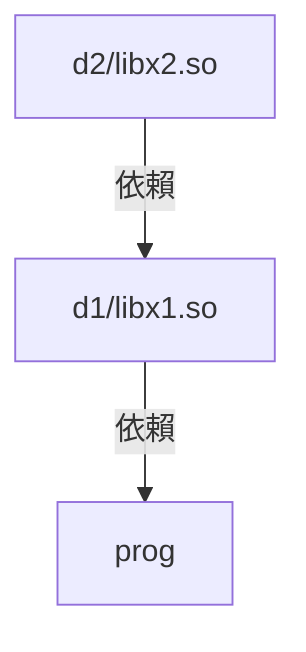

# TLPI Chapter 41 共享庫基礎

## 41.1 目標庫

* ``cc`` 將 Source Code 編譯為 Object Code, 然後組合為 Executable
  * 組合的部份應該是 ``ld`` 做的， ``cc`` 只是呼叫他
* 透過 ``strip`` 可以刪除 Debug Information
* Source Code 可以給其他程式重複利用，但是 Source Code 可能會散佈在系統的每個角落
* Object Code 也可以重複利用，雖然下次使用不需要重複編譯，但是在 link 時要重新命名(?)
* 透過打包為庫，將一群 Object Code 包為一個單元
* 有分二種
  * 靜態
  * 動態

### 41.2 靜態庫

* 打包 Object Code
* 習慣名稱 ``libname.a``
* ``ar [options] archive obj-files ... `` 可以打包
* ``ar tv libname.a`` 可以察看 Archive 內的東西
* ``ar r`` 替換
* ``ar d`` 刪除

### 41.3 共享庫

* 靜態庫的問題，程式碼坑餘，每個 Executable 都有一份
* 靜態庫，修改需要重編譯
* 共享庫只共享 Code，變數不共享，裏面的 Global variable 和 static variable 不共享
* 其他優點
  * code 小，程式啟動快
  * 不用 Re-Link 執行檔案，光靠變更 shared lib 即可產生變更
* 缺點
  * 比較複雜
  * shared library 編譯時使用獨立位置的 Code，這在大多數ISA有效能開銷，因為多使用一個寄存器
  * 載入時要進行符號的重定位，因此會花一點時間

### 41.4 建立和使用 Shared Library

* App 可以自己選擇 Shared Library 的版本，或是最新版本
* 多個版本的 Shared Library 可以共同存在
* 這裡討論 Executable and Linking Format(ELF) Shared Library

下面這些命令可以建立 Static Library 的 Shared 版本

```shell
$ gcc -c -fPIC -Wall mod1.c mod2.c mod3.c
# -c      表示 Compile Code 成 Assembly 但是不要 Link，及產生 Object code
# -fPIC   如果支援，將程式碼編譯為無關位置的Code，對於 Dynamic linking 或是避免 Global Offset 
#         Table 的大小限制非常有幫助。沒意外背後是透過直接定址的方式來指定對象。
# -Wall   顯示所有警告
$ gcc -g -shared -o libfoo.so mod1.o mod2.o mdo3.o
# -g      產生的 Code 附帶 Debug Message
# -shared 產生 shared object，可以後續被 executable 載入近來
# -o      輸出檔案名稱
```

* 依照慣例 Shared Library 以 lib 開頭, .so 結尾

* 簡單的寫法

  ```shell
  $ gcc -g -fPIC -Wall mod1.c mod2.c mod3.c -shared -o libfoo.so
  ```

#### 產生位置獨立的 Code 很重要

由於 Shared library 不知道會被載入到哪個地方去，因此他的 Assembly code，對於 Global Varaible, Static/external Variable, String Constant, Function Address 的操作都必須是無關位置的。

在 Linux/86-32 上，可不使用 ``-fPIC`` 但是會喪失一些優點，包還該 Code 的 Page 不會在 Process 之間分享，另外絕大多數的架構下都一定要使用 ``-fPIC`` 。

```shell
# 檢視該 Code 是否有使用 -fPIC
$ nm mod1.o | grep _GLOBAL_OFFSET_TABLE_
$ readelf -s mod1.o | grep _GLOBAL_OFFSET_TABLE_

# 檢視該 lib 是否有任何 object module 沒有使用 -FPIC(有輸出代表沒使用)
$ objdump --all-headers libfoo.so | grep TEXTREL
$ readelf -d libfoo.so | grep TEXTREL
```

### 41.4.3 使用 Shared Library

* 我們需要標記 Executable 要嵌入的 Shared Library ，在 ELF 中以 ``DT_NEEDED`` 標記
* 必須要有一個機制，可以讓我們找出該 Shared Library 放在哪裡。如我他不在 Memory 要載近來

```shell
# 編譯程式且指定其使用的 Shared library
$ gcc -g -Wall -o prog prog.c libfoo.so
```

在執行程式時，會透沃 ``/lib/ld-linux.so.2`` 這個 Dynamic Linker ，我們可以給出 ``LD_LIBRARY_PATH`` 這個環境變量來告訴對方 非標準的 library directory 位置。記得執行 ``prog`` 時該 linker 可以摸得到 ``libfoo.so``。

#### Static Link vs Dynamic Link

* Shared Library 除了經歷過 Dynamic Link 也會經歷過 Static Link。
* 術語 **linking** 用來表示使用 ``ld`` linker 將多個編譯過的 Object Code 組合為一個 Executable
* ``ld`` 也可以稱為 linkage editor


### 41.4.4 共享庫 soname

* 從檔案的真實名稱(Real name)找到 Shared Library
* 更常見的作法，使用別名建立 Share library，該名稱稱為 soname (ELF 中的 ``DT_SONAME``) 
* 如果有 shared library 有 soname，會優先使用他，否則就算了
* soname 可以提供一層抽象， Executable 可以在執行時採用不同但是間容的 Library。

```shell
# 建立有 soname 的 lib
$ gcc -g -c -fPIC -Wall mod1.c mod2.c mod3.c
$ gcc -g -shared -Wl,-soname,libbar.so -o libfoo.so mod1.o mod2.o mod3.o

# 察看 soname
$ objdump -p libfoo.so | grep SONAME
$ readelf -d libfoo.so | grep SONAME

# 編譯 Main
$ gcc -g -Wall -o prog prog.c libfoo.so

# 建立 symbolic link, 因為要的對象是 libbar.so 而非 libfoo.so
$ ln -s libfoo.so libar.so
$ env LD_LIBRARY_PATH=. ./prog
```

* 通常 soname 會對應到一個 Symbolic file 。

#### 載入步驟

1. 執行程序， ``/lib/ld-linux.so.2`` 載入程式
2. 發現需要 libbar.so
3. 透過 ``LD_LIBRARY_PATH`` 和正規 library dir 查找他
4. 找到後載入 libbar.so 到記憶體內

> 可以去 /proc/PID/maps 看到 Process 目前使用的 Shared Library

## 41.5 共享庫工具

#### ldd

``ldd`` 可以顯示一個 Executable 使用到的 Shared Library。

對於大多數 Executable 一定會包含這兩項

* libc.so.6 這是 C 的正規 Library
* /lib/ld-linux.so.2 這是 Linker，名稱可能會隨架構不同而有所改變

#### objdump, readelf

``objdump`` 和 ``readelf`` 可以翻到一些執行檔案的細節，

#### nm

可以列出 Symbols，如果要查找 Symbol 可以靠他

```shell
$ nm -A /usr/lib/lib*.so 2> /dev/null | grep ' crypt$'
```


## 41.6 共享庫版本和命名

Shared Library 的命名涉及兩個數字

* major-id，每當釋出一個不能向後間容的版本，必須提升這個數字，這個數字視為 Share library 名稱的一部份
* minor-id，釋出可以煎容的版本時使用這個數字，通常當作修補號或是補丁號使用，**可以是任意字串**
* 寫作 ``libname.so.major-id.minor-id``

在 Linux 裏面，通常是 soname 對應到一個 Symbolic link，而該 Link 則指向不同 minor 版本的 Shared Library。比如

```
libdemo.so.1		-> libdemo.so.1.0.2
libdemo.so.2		-> libdemo.so.2.0.0
libreadline.so.5	-> libreadline.so.5.0
```

### linkname

除了 realname, soname 之外還有這個 linkname，他只有包含檔案的名稱，如 ``libbar.so`` ，他總是指向最新版本的 Shared Library。通常來說 linkname 檔案和 soname 檔案會放在同一個資料夾。

``ldconfig`` 可以用來維護 soname 的編號，他總是保持 Shared Library 的版本最新。

linkname 可能是以 Symbolic link 指向 soname file

## 41.7 安裝 Shared Library

* ``/usr/lib`` 大多數 Standard Shared library 擺放的位置
* ``/lib`` 系統啟動時會使用到的庫放這(啟動時可能沒有掛載 /usr/lib)
* ``/usr/local/lib`` 安裝非標準或是實驗性的 shared library
* ``/etc/ld.so.conf`` 列出的其中一個檔案

#### ldconfig

解決這些問題

* Shared library 四散，尋找 library 的過程可能會很緩慢
* 沒有人管理 soname/ linkname 的新舊，刪除或安裝都可能需要變更

他會

1. 搜尋每個 shard library 的目錄內容，建立 ``/etc/ld.so.cache`` 這個檔案，其為所有 shared library 的 位置 cache。可以用 ``ldconfig -p`` 檢視其內容
2. ``ldconfig`` 根據前面提到的規範自動將 soname 檔案更新

## 41.9 升級 shared library

* 即使有程序在使用檔案也可以更新
* 執行中的程式要關閉再開才會更新 Shared Library
* linkname 似乎要自己手動更新(？)

## 41.10 在目標文件指定 Library Directory

上面提到的，指定 Linker 搜尋的 Shared Library 位置有二種方法

* 使用 ``LD_LIBRARY_PATH`` 環境變數
* 直接把他塞到 /lib, /usr/lib, /etc/ld.so.conf 裏面

還有另外一種方法

* 編譯時指定 ``-rpath`` ，給出的地址會塞到 Executable 內，當該 Executable 被執行時，這個地址的資料夾或是檔案會被當作 Linker 搜尋共享庫的路徑之一。也可以在編譯時，以環境變數 ``LD_RUN_PATH`` 取代

  ```shell
  $ gcc -g -Wall -Wl,-rpath,/home/mtk/pdir -o prog prog.c libdemo.so
  ```

#### 共享庫互相依賴



可以使用 ``rpath`` 解決

```shell
# 編譯libx2.so模組
$ cd /home/mtk/pdir/d2
$ gcc -g -c -fPIC -Wall modx2.c
$ gcc -g -shared -o libx2.so modx2.o

# 編譯libx1.so
$ cd /home/mtk/pdir/d1
$ gcc -g -c -fPIC -Wall modx1.c
$ gcc -g -shared -o libx1.so modx1.o \
			-Wl,-rpath,/home/mtk/pdir/d2 -L /home/mtk/pdir/d2 -lx2
# 使用 -rpath 在 gcc 編譯時直接指定他 執行時 的 Shared Library 來自何處
# 使用 -L 指定其編譯當下的 Shared library 要從哪裡搜尋
# 使用 -l 來決定要載入的 lib 名稱

# 編譯 main
$ cd /home/mtk/pdir
# 這個寫法已經過時
#$ gcc -g -Wall -o prog prog.c -Wl,-rpath,/home/mtk/pdir/d1 \
#			-L/home/mtk/pdir/d1 -lx1
$ gcc -g -Wall -o prog prog.c -Wl,-rpath,/home/mtk/pdir/d1,-rpath,/home/mtk/pdir/d2
			-L/home/mtk/pdir/d1 -L/homemtk/pdir/d2 -lx1 -lx2
# 使用 -rpath 決定其執行時的 shared library 在哪裡搜尋
# 使用 -L 決定編譯時的 library 在資料夾
# 使用 -l 指定載入 lib 名稱
```

多個 dependencies 時，預設不會遞迴地解鎖 RPATH，所以你必須 link libx1 和 libx2。這部份和書本的敘述不太一樣，因為這是後來改的。

#### ELF DT_RPATH, DT_RUNPATH

ELF 有規範了兩種可以嵌入到程式內的 Library Path

* ``DT_RPATH`` 最早的版本，其優先權大於 ``LD_LIBRARY_PATH``
* ``DT_RUNPATH`` ，其優先權低於 ``LD_LIBRARY_PATH`` 可以透過 ``--enable-new-dtags`` 啟用

#### RPATH 中使用 $ORIGIN

你可能不希望使用者直接把 Library 放在 Standard Directory 內，而叫使用者指定 Directory 之類的事情又很麻煩，為此，你可以在 RPATH 中指定 ``$ORIGIN`` ，他將會參照到 Executable 所在的目前目錄。

```shell
$ gcc -Wl,-rpath,'$ORIGIN'/lib ...
```

## 41.11 在 Runtime 找到 Shared Library

Linker 在解析 Shared Library 依賴時，他會先看連結依賴字串是否有包含斜線，如果有的話該字串會被視為他要載入的路徑。反之依照下面的順訊進行處理

1. 查找 ``DT_RPATH`` 是否有包含不在 ``DT_RUNPATH`` 內且存在的檔案，有就載入
2. 查找 ``LD_LIBRARY_PATH`` 定義的 files，項目之間以冒號隔開，如果該執行檔有 Set-User-ID 或是 Set-Group-ID，則會忽略。這是為了避免 user 欺騙 linker 載入惡意的 Shared Library。
3. 查找 ``LD_RUNPATH`` 內容
4. 查找 ``/etc/ld.so.cache`` 
5. 查找 ``/lib`` 和 ``/usr/lib`` 

## 41.12 Runtime 符號解析

因為現在是多個 Shared Library 組合在一起，又 C 缺乏 Namespace ，所以全域 Symbol name 衝突的情況有可能會發生。當有 symbol name 衝突時

* 主程序的 Global Symbol 優先於 Library 的
* 如果多個 Library 之間的 Symbol 有衝突，則 Symbol 會綁定到掃描過程中第1個找到的定義

由於這些機制，這使得 Library 呼叫的 function 搞不好不是他所希望的。為此可以在編譯的過程中使用 ``-Bsymbolic`` 這個選項，使其 Library 內的 Symbol 會參照自己 library 內的定義。

```shell
$ gcc -g -c -fPID -Wall -c foo.c
$ gcc -g -shared -Wl,-Bsymbolic -o libfoo.so foo.o
$ gcc -g -o prog main.c libfoo.so
$ env LD_LIBRARY_PATH=. ./prog
```

## 41.13 使用 Static Library 取代 Shared Library

絕大多數你會享用 Shared Library ， 有些情況下你會需要 Static Libraray

* 你的程式可能會跑在 Chroot Jail 內，你的程式不能使用 Shared library
* 使程式免於 shared library 升級造成的 bug
  * 代價是更多磁碟空間和記憶體

當透過 ``-L<dir> -l<libname>`` 載入時，假設目錄下有 Shared Library 和 static library 兩種版本，會優先使用前者。如果要強制使用後者可以

* 在 gcc 中指定 static lib 的路徑名稱(libxxx.a)
* ``gcc -static`` 
* ``gcc -Wl,-Bstatic``  或是 ``gcc -Wl,-Bdynamic`` 

## 總結

* 沒什麼好說的

