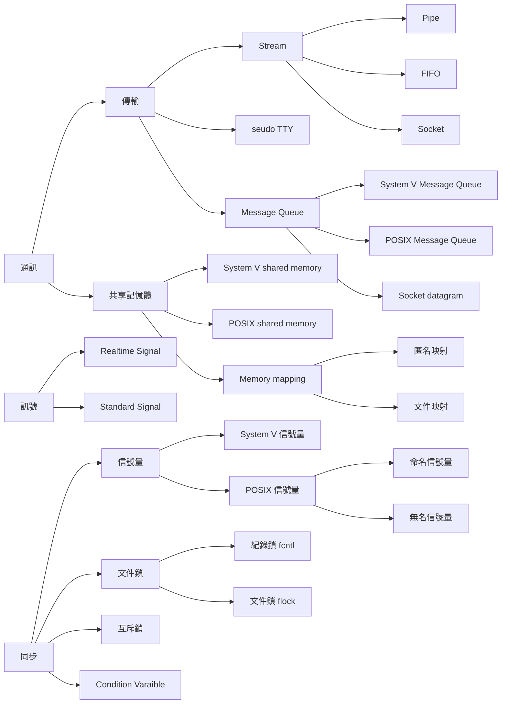
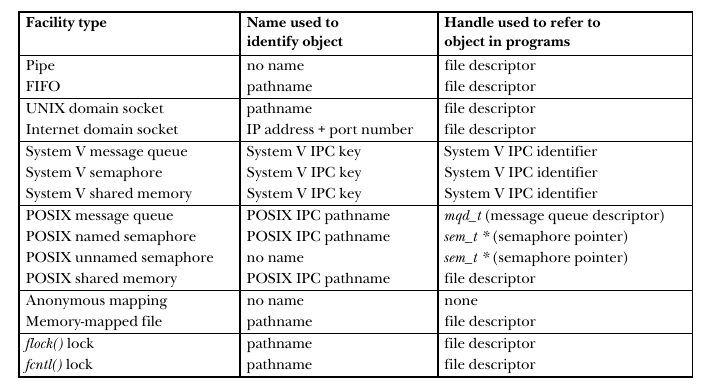
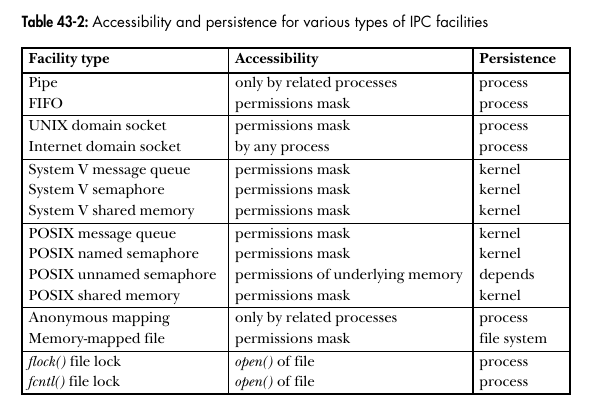

# Chapter 43 IPC Introduction

## 43.1 IPC 工具分類

IPC 內的所有方法大致能夠分類三種

1. 通訊用：專注於傳輸資料
2. 同步用：專注於 Process 和 Thread 之間的同步互動
3. 訊號：某種通知，但如果你真心想要，他也可以用於傳輸少量資料和同步。

市面上流傳著各式各樣的 IPC 方法，有些很類似，這是因為不同工具在早期由不同的系統各自發展而成。如 FIFO 來自 SystemV 而 Socket 最早來自 BSD。後續規範又出了許多不同的 POSIX IPC 工具。

## 43.2 工具

### 數據傳輸

* 數據傳輸工具

  需要將資料進行兩次傳輸，第一次是寫入時，從 User Memory 塞到 Kernel Memory ，第二次是讀取時，由 Kernel Memory 塞到 User Memory。

  * Steam(字節流)：透過 Pipeline, FIFO, Socket 交換資料，其交換的資料是沒有任何分隔或是切割的，每個讀取操作可能會從 IPC 工具中掏出任意數量的 Bytes，無論對方寫入了什麼資料。這個模型參考了 UNIX 的傳統概念：每個檔案都是一個 Byte Stream。
  * Message：透過 System V Message Queue / POSIX Message Queue / Datagram Socket 傳輸資料，其資料是有分隔分段的，每次讀取或寫入都是一整條訊息，無法只讀取一部份，也無法一次讀取多個資料
  * Pseudo Terminal：在某些特殊情況下使用的通訊工具，後續會介紹

* 共享內存

  讓兩個 Process 在 Page Table 內一起分享同一塊 RAM 分頁。因為資料不需要到處複製

  * 這個方法的特色是速度更快，因為資料沒有彼此複製，但是不存在同步機制，當另外一個 Process 在寫入資料時，不應該讀取其內容。在 shared memory 中，通常使用信號量進行同步
  * 放入的資料不會被破壞

上面這二者有一個顯著的差距，單一個數據傳輸工具可能會有多個 listener ，而讀取操作是有破壞性的，但一個 Process 讀取資料後，該資料會銷毀，其他 Process 沒辦法讀取到(Socket 中可以透過 ``MSG_PEEK`` 來進行非破壞讀取， UDP 允許將資料推到多個接收者手上)。

另外讀取和寫入是同步的，讀取還沒來的資料，預設會造成 Block。

## 43.3 同步工具

* 信號量(Semaphores)：這是一個由 Kernel 維護的整數，永遠不會少於0，一個 Process 可以增加或減少他，**當某個 Process 將其值減少到少於0，該操作將會被 Block，直到其數值增長到 0**。Semaphores 的含意由 Application 自己定義，最常見的情境是兩個 Process ，當要使用東西時給其值從 1 減少，當另外一個 Process 要使用時，會將其值減少到少於 0 ，這時就會被 Block(當然可以指定非阻塞)。當有多 n 個資源可以共享時，你可能會想將其 Semaphores 值設定為 n 。Linux 提供 System V Semaphores 和 POSIX Semaphores。
* 文件鎖：用來協調多個 Process 對同一個檔案操作的一種 Lock。鎖有分兩種，讀鎖(共享鎖)和寫鎖(互斥鎖)，任意 Process 可以持有同一個文件或文件某區域的讀鎖。但是一但友人取得該文件或該文件某區域的寫鎖時，其他進程將無法操作該檔案。 Linux 透過 ``flock()`` 和 ``fcntl()`` System Call 來管理這些工具。
* Mutex 和 Condition Varaible 見 Chapter 30。一般用來同步 POSIX Thread

> Linux 有額外提供一個非標準的同步方法： ``eventfd()`` ，該 System Call 將會建立一個 eventfd 對象，該對象包含一個由內核維護的 8 word unsigned number。當對這個 FD 寫入一個整數，會將其值加到對象上面，當使用 ``read()`` 讀取且其值為 0 時將會 Block，非0則會將對象重設為0。可以使用 ``poll()``, ``select()`` 來測試是否非 0。任何 fork() 產生的新 Process 預設會繼承這個 FD。
>
> 這可以當作是 FD 版本的同步機制，在 fork() 時可以保留他。

## 43.4 IPC 工具比較

每個 IPC 都需要一個 Name 來識別各個 Object。

* 數據傳輸工具是 Stream 導向的，而  Message 是消息導向的，依照你的使用情境選擇好的方法
* SystemV / POSIX Message Queue 提供一個 feature，可以給訊息優先等級。
* Pipe, FIFO, Socket 是藉由 File Descriptor 實現的，支援 Select(), poll(), epoll()，他允許多個 Process 針對同一個 FD 資源互動，相比之下 Message Queue 因為不是使用 FD 沒有支援這些操作。
* UNIX domain socket 可以用來傳遞 File Descriptor
* UDP Socket 可以用來廣波訊息給多個使用者

其他注意事項：

* ``fcntl()`` 會偵測 Dead Lock 的情況，當 ``fcntl()`` 有發生 Dead Lock 的潛在可能，取鎖時會直接噴錯。另外 System V 和 POSIX Semaphores 沒有這些所有權的管理，所以取得時不會進行 Dead Lock 檢查。
* 當 Process 離開，其 ``fcntl()`` 獲得的鎖會自動釋放， System V Semaphores 有類似的撤銷特性，但是只在部份情境可靠， POSIX 沒有這類設計。

#### Internet Access

所有的 IPC 方法中只有 Socket 允許通過網路交換資料， Socket 又有分為兩個作用域

* UNIX Domain Socket: 只能在同一個系統上進行通訊
* Internet Domain Socket: 能夠透過 TCP/IP 網路和不同系統的主機互通。

二者的差異非常少，要將 UNIX Domain Socket 改到 Internet Domain Socket 只需要少許的改變。

#### Portability

基本上 System V IPC 出現得比較早，其可移植性比 POSIX IPC 更好。

#### System V IPC 設計問題

System V IPC 工具的設計架構獨立於 UNIX I/O 模型，這導致他的用法更複雜。 POSIX IPC 工具的存在是為了解決這些問題。

* System V IPC 沒有連結概念，沒有提供打開的 IPC 對象 Handler(類似於 FD)，因此 kernel 不會紀錄該 Process 打開了該對象，因此 kernel 也不會紀錄有多少 Process 使用某對象。因此 Application 需要編寫額外的程式碼來處理這些事情，很麻煩。
* System V IPC 的 API 獨立於 UNIX I/O ，且用起來比較複雜，相當垃圾。

#### 可訪問性

* 對於 FIFO 和 Socket 這類的 IPC 工具，其 Object Name 位於 File system 之中，所以其訪問權限是由該相關文件的 File Permission Mask 來決定。雖然 System V IPC Object 不存在於 File System 內，但是每個對象還是有紀錄權限。
* 某些 IPC (Pipeline, Anonymous Memory mapping) 被設計為，只允許相關的 Process 訪問，即他們只能夠透過 fork() 來分享使用權限。
* POSIX unnamed semaphores 是透過對包含該 semaphores 的共享內存區域訪問性來決定。
* 如果要給文件加鎖，首先你必須要先打開他(即持有他的 File descriptor
* Internet Domain Socket 的連結是沒有限制的，你可能需要在 Application 實作相關的 Access Control。

#### 持久性

即 IPC 工具的生命周期，有三種

* Process Persistence ： 如有任何一個 Process 持有該 IPC 對象，則他會一直存在，直到所有 Process 都關閉了對象。
* Kernel Persistence： 只有顯式地從 Kernel 刪除該對象或是系統關閉時，該對象才會消失。
* File system Persistence： 該對象即使系統重開也會一直存在，直到被刪除，唯一一種符合這種特性的 IPC 是基於 Memory Mapping 的文件共享記憶體。

#### 性能

這裡不太考慮他們彼此的效能，因為

* ICP 工具的性能對於 Application 的整體性能影響不是很大
* IPC 工具在不同系統可能採用不同的實作
* IPC 工具的效能可能受到環境和使用方式影響，包含交換的資料數量大小，IPC 工具未讀取的資料數量，資料的交換是否需要 Context Switch，系統負載情況。

如果你認為 IPC 效能很重要，最好弄一層抽象隱藏 IPC 工具的細節，然後後面在抽象層之下以不同的 IPC 工具測試效能。

