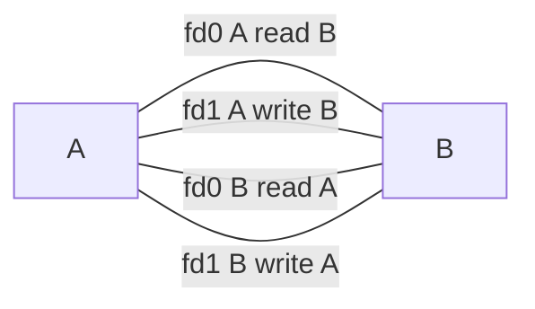

# Chapter 44 管道和 FIFO

* Pipe 是 UNIX 最古早的 IPC 方法
* FIFO 可以說是 Pipe 的變形，不同於上者，他可以讓任意兩個 Process 溝通

## 44.1 概述

提一堆東西

### Pipe = Character Stream

Pipe 是一個 Character Stream，他沒有消息或是邊界的概念。能夠從 Pipe 中讀任意大小的數據塊，數據總是有順序的，他們出來的順序等同於進來的順序。且很重要的一點，Pipe 不能夠使用 lseek() 來隨機訪問資料。

如有離散消息的需求，最少用其他 IPC 機制，如 Message Queue 或是 Socket。

### 讀取 Pipe 數據

如果 Pipe 輸入被關閉，則讀取會回傳 EOF (即 read() 回傳 0)

### 原子寫入

如果寫入 Pipe 的資料量不超過 ``PIPE_BUF`` ，則可以確保寫入是 atomic 的(即多個 process 寫入一個管，不會發生資料混合的情況)。 Linux 上其值為 4096。

* 一旦超過該值， Kernel 可能會將寫入資料分成任意大小的段，且段之間能會和其他 Process 寫入的資料交叉。
* write() 會在必要時 block 住，直到 Pipe 有足夠的空間能夠原子地插入寫入資料。
* 如果寫入數據大於 ``PIPE_BUF`` 則 write() 會儘可能地寫入資料到填滿整個 Pipe。
* write() 在寫入 Pipe 的過程中，是可能發生資料只寫一半的情況(如想寫64個字，但是實際上 write() 回傳他成功了，且只寫了 32 個字，即 Partial Write)，這會發生於訊號處理器中斷 Block 了 write() 時。該 write() 調用將會解除 Block 且回傳成功寫入的字數。

### Pipe 的容量是有限的

Pipe 實際上是一個在 Kernel 記憶體內維護的緩衝 Buffer。他的儲存能力是有限的。在 Linux 2.6.11 之後， Pipe 的儲存能力是 65536 Bytes。

> 使用較大的 Pipe Buffer 對效能有正影響，由於寫滿資料後，CPU 要進行 Context Switch ，將控制交換到欲讀取的 Process，當 Buffer 比較大時，可以減少 Context Switch 的次數。
>
> 從 Linux 2.6.35 開始，可以修改 Pipe 的儲存能力， Linux 特有的 ``fcntl(fd,  SET_PIPE_SIZE, size)`` 可以將特定 PipeBuffer 的大小改變，對非特權 Process 其數值最大可以到 ``/proc/sys/fs/pipe-max-size`` ，預設為 1048576 

## 44.2 建立/使用管道

```c
#include <unistd.h>

int pipe(int fieldes[2]);
```

成功呼叫會回傳兩個 FD，一個是 讀取端(fieldes[0]) 和寫入端(fieldes[1])。

>  ``ioctl(fd, FIONREAD, &cnt)`` 回傳 FIFO 或管道中還沒讀取的資料數量。

* 最主要的應用為 fork() 後和子 Process 共享 FD，共享後用不到的 FD 記得關掉以節省資源。
* 實際上你可以把管道透過 UNIX Domain Socket 傳送給完全不相干的 Process。

### 關閉不使用的 Pipe FD 粉重要

這絕對不是什麼節省系統資源之類的幹話



上面這個情進中，AB 彼此都有開著 Pipe FD 沒有關掉非必要的 FD。而 A 扮演輸出者， B 扮演輸入者。假設現在 A 寫完資料了，將他的 A 把他的 fd0, fd1 都關掉


理論上這個時候 B read A 的 read() 請求會因為對方已經關閉 Pipe 而回傳 EOF，但是實際上該 Pipe 並沒有全部關閉，因為 B 自己也握著 Pipe 的輸入端，系統會下意識認為這個 Pipe 還有資料近來的可能，所以實際上 read() 會進入 Block 的狀況，而 B 此時就會陷入永久的睡眠，停止了思考。

### 對彼端已經關閉的 FD 寫入

假設有一個 Process 對 Pipe 寫入資料 ，而該 Pipe 的讀取端已經沒有任何人持有，此時寫入將會觸發 SIGPIPE 信號，預設會導致 Process 關閉。而 write() 則會回傳 ``EPIPE`` 錯誤(管道損毀)

> SIGPIPE handler 對 write() 的處理比較特殊，一般來說 write() 被中斷時，會依照該 signal 是否有設定 SA_RESTART 或因為 EINTR 錯誤而重新自動啟動 write() ，因為該對象是 PIPE，且是已經破掉的 Pipe，重新寫一次也不會改變他已經破掉的事實。所以不會重新啟動

## 44.3 使用 Pipe 進行同步

這裡有程式碼，示範如何使用 Pipe 進行多個 Process 的同步，相較於使用 Signal。

* 使用 Pipe 同步，協調多個 Process 的動作比較方便， Signal 因為無法排隊所以顯得比較不可靠
* 使用 Signal 同步，他可以對整個 Process Group 的所有 Process 簡單地進行廣波

## 44.4 使用 Pipe 當作連結過濾器

這邊提到如何使用 ``dup2`` 和 ``dup`` 做到正規管道替換。

## 44.5 通過 Pipe 語 Shell 進行通訊 popen()

```c
#include <stdio.h>

FILE *popen(const char *command, const char *mode);
int pclose(FILE *stream);
```

``popen()`` 建立一個 Pipe，然後建立 shell 子程序，而 shell 子程序又建子程序執行 command 字串，而 mode 決定是對該程式的寫入(w)讀取(r)。

* 不可以使用 ``fclose()`` 因為他不會等待 Subprocess 
* ``pclose()`` 回傳 exit status
* system() 類似於 popen() ，差別在於前者該命令封裝於函數調用內，後者是並行地處理。
* popen() 不可以忽略某些訊號
  * SIGINT, SIGQUIT, 由 terminal 送出的中止中斷才會傳到 popen 的 process 手上，他們在同個 Process Group
  * 不可以賭塞 SIGCHLD，否則 pclose() 之前如果有調用 wait()，會導致主程式幹到 popen() 生出來某個 Process 的離開資料

## 44.6 管道和 stdio 緩衝

* 由於 ``popen()`` 其輸出並非 Terminal，所以會啟用 Block Buffer，這意味著 Buffer 滿了資料才會送到對方那邊，絕大多數情況下這個情境沒有問題，但是假設需要對方能馬上接收訊息，則需要定期掉用 ``fflush()`` 或是使用 ``setbuf(fp, NULL)`` 關閉 stdio 緩衝。
* 假設對 ``popen()`` 輸入資料，情況會比較麻煩，只有當對方那邊進行 setbuf 或是 fflush 或 buffer 滿了才能立即收到資料，這時你能做的事情就很有限了，除非你可以修改對應程式的程式碼不然無解
* 假設不能夠修改原始碼，可以使用 Pseudo Terminal 來代替 Pipe，前者是終端後者是 IPC 通道，對 Process 來說他就是一個 Terminal，因此會啟用 Line Buffer。

## 44.7 FIFO

* FIFO 類似於 Pipe，但是他在 Filesystem 中有實體名稱，打開的方法就如同一般的檔案。
* 使用 stat 檢視檔案訊息時，會表示他是 S_IFIFO 檔案，使用 ls 顯示時會以 ``|`` 管道符號表式。
* 可以使用 ``mkfifo [-m mode ] pathname`` 建立一個 FIFO 檔案

```c
#include <sys/stat.h>

int mkfifo(const char *pathname, mode_t mode);
```

> 也可以使用 ``mknod(pathname, S_IFIFO, 0) `` 建立

* FIFO 預設會下意識地進行讀取寫入雙方的同步
  * 讀取方使用 open() O_RDONLY 打開時，會一直 Block 直到另外開啟寫入
  * 寫入方使用 open() O_WRONLY 打開時，另一端沒人則會調用失敗。 errno 為 ENXIO
  * SUSv3 規範，使用 O_RDWR 打開會造成未知的結果，如要避免 Block 請用 O_NONBLOCK
* ``tee`` 可以用來建立雙重管線，之所以有這個命名是因為 ``T`` 大寫就類似於管線中的 Branch。

## 44.8 使用 Pipe 實現 Client/Server Application

這邊透過 FIFO 建立一個 Client/Server Application。連接過程

1. Client 向 Server 的公共 FIFO 發起一個 Request 要求連接
2. Server 建立對應的溝通用 FIFO，且回傳該 FIFO 位置給 Client
3. Client 透過 FIFO 發送資料

這個過程中我們會使用一個公共的 FIFO 供於連接，但是這個連接過程需要傳送一些訊息資料，包含 Client Process ID 和一些數據，因為這個通道是公用的，我們需要一個方法來辨認資料段，這時我們大致上有三種傳輸方法

* 使用分隔字符表示訊息的結尾

  這各方法需要用額外的方式對分隔字服做轉譯，如使用 ``\n`` 當作分隔符號，則當資料出現他時，可能要以 ``\\n`` 表示他，而接收端和輸出端都必須要對此進行處理，造成效能比較差勁和實作複雜。

* 使用 Header 表示資料長度

  這方法的實作很簡單，效能也很好，缺點是一旦有不符合規則的資料近來(錯誤的長度)，就有可能爆炸

* 總是使用固定長度表示一段資料

  會有一部份的資料頻寬被浪廢掉，但是效能好實作也簡單

> 注意不管選擇哪一個傳輸方法，都要注意其長度不可以超過 PIPE_BUF 長度，以避免 Kernel 對訊息進行拆分導致資料內容錯亂

假設連線通道只有一個人使用，也可以考慮寫完就關閉，當嘗試讀取，但是發現檔案另外一端開啟，則會遇到 EOF ，這時就可以知道訊息已經結束。但是這方法對於多方共享連線通到時不可行，因為可能有其他人打開該通道，此時 EOF 就不會發生，反之是一個 Read Block。但是對於 Socket 可以這麼做，因為 Kernel 會為每個連線建立獨立的連線通道。

## 44.9 非阻塞 I/O

```c
int fd = open("fifopath", O_RDONLY | O_NONBLOCK);
if (fd == -1) errExit("open");
```

非組塞只有在另外一端還沒打開時才會達到他的效果。

* 以讀取打開，另外一端沒有開，則 open() Block
* 以讀取打開，另外一端有開，則 open() 沒事
* 以寫入打開，另外一端沒有開，則調用失敗，且 errno = ENXIO

* 讀取沒有 Writer 的 FIFO 不會發生任何事情，不會回傳資料
* 寫入沒有 Reader 的 FIFO 則會收到 SIGPIPE，而 write() 回傳 EPIPE

使用 NONBLOCK FIFO 的好處有

* 允許單個 Process 打開同一個 FIFO 的兩端
* 防止兩個 Process 互相產生 FIFO 的 Dead Lock

### 非阻塞 read() 和 write()

``O_NONBLOCK`` 會改變 open() 的語意，後續的掉用都是非阻塞的，可以後天修改

```c
// Set Non block
flags = fcntl(fd, F_GETFL);
flags |= O_NONBLOCK;
fcntl(fd, F_SETFL, flags);

// Disable Non block
flags = fcntl(fd, F_GETFL);
flags &= ~O_NONBLOCK;
fcntl(fd, F_SETFL, flags);
```

## 44.10 管道和 FIFO 中 read() write() 的語意

### Read

| NonBlock | 寫入端打開   | 寫入端關閉 |
| -------- | ------------ | ---------- |
| No       | 堵塞         | 返回 EOF   |
| Yes      | 失敗(EAGAIN) | 返回 EOF   |
|          |              |            |

### Write

| NonBlock | 讀取打開且 n <= PIPE_BUF                      | 讀取打開且 n > PIPE_BUF                                      | 讀取關閉        |
| -------- | --------------------------------------------- | ------------------------------------------------------------ | --------------- |
| No       | 原子地寫入 n 字，可能堵塞直到足以寫入資料為止 | 完全寫入 n 字，過程中可能堵塞，也可能發生數據交叉            | SIGPIPE + EPIPE |
| Yes      | 空間足夠塞入 n 字則直接寫入，否則 EAGAIN 錯誤 | 如果空間夠，就寫入 1 ~ n 任意的資料量，可能會發生數據交叉，假設整個都是滿的沒法寫，則 write() 會噴 EAGAIN 錯誤 | SIGPIPE + EPIPE |

* 滿了又不想等嗎？ EAGAIN
* 可以原子地塞入嗎？ 能 Block 就 Block ，否則 EAGAIN
* 不能原子的塞入嗎？可以 Block 就 Block 到寫完，否則能寫多少就寫多少，

## 44.11 總結

* FIFO 的運作和 Pipe 完全一樣，差別在於他在 FileSystem 上有一個名子