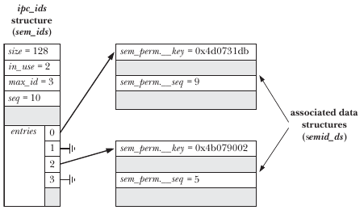

# Chapter 45 System V IPC 介紹

System V 有三種溝通機制

* Message Queue 
  * 資料有所謂的邊界存在
  * 類似於 Pipe，用來在 Process 之間傳輸資料
  * 可以透過類別選擇來選擇消息，而非以寫入順序決定
* Semaphores 
  * 用來同步 Process
  * 一個由 Kernel 維護的整數
* Shared Memory
  * 速度最快的 IPC

> IPC 這個 System Call 在大多數平台上是 System V IPC 到 kernel 的入口

### 打開 System V IPC 對象

* ``msgget()``, ``semget()``, ``shmget()``
* 這些函數需要給一個 Integer，他為對象的 Key。類似檔案名稱。呼叫時有可能會
  * 假設對象不存在，使用給定的 key 建立新的 IPC Object，且返回 Descriptor
  * 假設對象存在，返回 key 對應的 IPC Descriptor
* 這些資源都是全局可見的，假設 IPC Object已經存在，可以直接跳過 get 調用。只要能夠想辦法取得 Object 的 Descriptor 即可。比如把他寫入別的文件。
* umask 不會控制 IPC Object 的權限
* 可以透過將 flag ``IPC_PRIVATE`` 設起來，以限制只能打開已經存在的 IPC Object

### 控制 IPC Object

* ``msgctl()``, ``semctl()``, ``shmctl()`` 
* ``IPC_RMID`` 可以用來刪除對象
* 刪除的當下所有資源都會立刻失效，這點和 Unix Filesystem 的特性不同
  * Shared Memory 是一個例外，只有所有使用該分享記憶體的 Process 離開才會釋放該記憶體資源
* 在多個 Process 的應用中，需要最後一個 Process 將資源釋放，這使得釋放資源變得很困難
* IPC 資源有限，要適時釋放

## 45.2 IPC key

如何產生唯一的 Key?

* 使用 IPC_PRIVATE
* 使用 ftok() 函數產生一個接近唯一的 Key

## 45.3 關聯數據結構和權限

* ``ipc_perm`` 描述 System V IPC 資源的權限

  ```c
  struct ipc_perm {
      key_t		__key;
      uid_t		uid;		// owner
      gid_t		gid;		// owner
      uid_t		cuid;		// creator
      gid_t		cgid;		// creator
      unsigned short	mode;
      unsigned short __seq;
  }
  ```

* 可以透過 ``shmctl(id, IPC_STAT, &shmds)`` 取得上述資源權限資訊

* 可以透過 ``shmctl(id, IPC_SET, &shmds)`` 修該資源權限資訊

* 權限判定

  * 假設是 特權進程(CAP_IPC_OWNER) 則可以獲得所有 ICP Object 的權限
  * 如 Process 的 Effective User ID 等同 Owner UID 或 Creator UID 則有 User 權限
  * 如 Process 的 Effective Group ID 或任何 副 Group ID 相同，則會賦予該對象 Group 權限
  * 都沒有就 Other 權限

* 取得 IPC 的 Descriptor 時只會以 ``msgget(...)`` 裏面指定的權限下去做檢測，假設你沒有任何權限也可以取得 Descriptor ，但後續的讀寫操作依然會噴錯， msgget 只是先做檢查

## 45.4 IPC Descriptor 和 Client/Server Application

假設伺服器重新啟動，我們會需要手動將舊的 IPC 通道關閉且重開。不重開 IPC 通道的話，其通道內會殘留著上次的資料，通常你重開之後也不會想要用到他們，所以最好的方法就是全部捨棄。當 get 呼叫時給定 IPC_CREATE 和 IPC_EXCL 可以用來表示 IPC Object 剛才爆炸了

```c
while(msqid = msgget(key, IPC_CREAT | IPC_EXCL | MQ_PERMS)) == -1) {
    if (errno == EEXIST) {
        msqid = msgget(key, 0);
        if(msqid == -1)
        	errExit("msgget() failed to retrieve old queue ID");
        if(msgctl(msqid, IPC_RMID, NULL) == -1)
            errExit("msgget() failed to delete old queue");
    }else{
        errExit("msgget() failed");
    }
}
```

對於其他 Client，他們也需要知道 Server 已經掛了，這樣才能同步彼此的狀態，如果是使用相同的 Get 調用，則只要參數一樣就總是會產生相同的 Descriptor。對此後面會提到一個算法解決方案，確保即使 key 一樣，其產生的 Descriptor 會和舊的 Client 完全不同

## 45.5 System V IPC get 調用方法

Kernel 內部會給每個 IPC 方法紀錄一個 ipc_ids struct，他描述著對應 IPC 方法的所有 Global Information。其內容包含一個動態變化的指標陣列 entries。每個項目都指向某 Object Instance。



這整個過程中， seq 扮演很重要的角色，新建立的 IPC 資源會得到目前的 seq 值，之後替他加1。這樣就可以確保刪除後新建立的 Descriptor 會不一樣。當系統建立了 65535 個 IPC Resource 後可能會出現重複的 Descriptor，但是這機會非常小

詳細過程看書

透過回傳的錯誤可以大略判斷發生了什麼事情

* EINVAL 代表，在 entries 搜尋該 index 時找不到項目，這意味著該對象可能從來都沒有被建立起來
* EIDRM 則意味著 entries 有搜尋到該 index，但是 seq 的部份不符合，所以參照對象是舊的，原本的可能已經被刪除

## 45.6 ipcs 和 ipcrm 命令

``ipcs`` 和 ``ipcrm`` 是 System V IPC 系列的 ``ls`` 和 ``rm`` 

## 45.7 取得所有 IPC Object 列表

Linux 有二種非標準方法可以取得 IPC Object 清單

* ``/proc/sysvipc`` 目錄中的文件包含所有 IPC Object
  * ``/proc/sysvipc/msg``
  * ``/proc/sysvipc/sem``
  * ``/proc/sysvipc/shm`` 
* Linux 特有 ``ctl`` 

## 45.8 IPC 限制

``ipcs -l`` 檢視限制