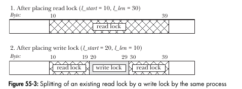

# Chapter 55 File lock

* ``flock()`` 給整個文件上鎖，源自 BSD
* ``fcntl()`` 對一個文件區域上鎖，源自 System V

### Lock 和 Stdio

由於 stdio 預設會緩衝寫入的資料，在上鎖和解鎖時要注意資料有沒有真的寫出去了。解決方法有

* 完全使用 read(), write() 來取代 stdio
* 在上鎖後立刻 flush stdio，解鎖前再 flush stdio
* 透過 ``setbuf()`` 來關閉 stdio 緩衝

### 鎖的種類

* 勸告式加鎖(Advisory locking)
* 強制式加鎖(Mandatory locking)

## 55.2 使用 flock() 

基本上 fcntl 可以完全取代 flock，但是還是要提一下。

```c
#include <sys/file.h>

int flock(int fd, int operation);
```

預設情況下，假設另外一個 Process 已經放上了不間容的鎖，則 flock() 會堵塞。

| Value   | Description            |
| ------- | ---------------------- |
| LOCK_SH | 放 Shared Lock         |
| LOCK_EX | 放 互斥鎖              |
| LOCK_UN | 解鎖 FD 引用的文件     |
| LOCK_NB | 發起非阻塞的 lock 請求 |

* 不論對該檔案是 Read/ Write/ Read&Write 都可以在文件上放置一個 Shared Lock 或是 Exclusive Lock
* 可以透過重複調用 ``flock`` 來做到修改 lock 型態，如 Shared lock 轉 Exclusive lock 反之亦然
  * 這個轉換的過程不是原子的，轉換的過程中需要先釋放原本持的鎖，再取得目標鎖，假設中間被他人插隊，會 Block 直到對方放手我們得到 Lock。假設有指定 Non-Block，則會轉換失敗且丟失原先持有的鎖。

### 鎖的繼承

由於鎖是綁在 File Descriptor 上而非綁在 i-node 上，當程式關閉時，鎖會自動釋放。

但如果你透過 ``dup`` 等系列的函數複製 Descriptor，該新 Descriptor 會指向同一個 File Lock。對該 Descriptor 的釋放操作等同於原 Descriptor 的釋放操作，二者是連動的

* fcntl 沒有這些問題
* flock() 的鎖在 exec 之後依然存在，除非該 FD 指定了 Close-On-Exec。

### flock() 的限制

* 沒辦法控制鎖的粒度
* 透過 flock() 只能放 Advisory Lock
* Linux NFS 不支援 flock()

## 55.3 使用 fcntl()

* 可以只鎖檔案的一部份，這通常稱為紀錄加鎖
* Linux 上可以把紀錄鎖放在任意類型的檔案上

```c
struct flock flockstr;

fcntl(fd, cmd, &flockstr);
```

### Struct

```c
struct flock {
    short l_type;		// F_RDLCK, F_WRLCK, F_UNLCK
    short l_whence;		// How to interpret 'l_start', SEEK_SET, SEEK_CUR, SEEK_END
    
    off_t l_start;		// Offset of begin
    off_t l_len;		// size
    pid_t l_pid;		// Process preventing our lock
};
```

可以取得的鎖有 ``F_RDLCK``, ``F_WRLCK``, 必須要持有對應的權限才可以獲得該鎖，否則會得到 EBADF 錯誤。

### Cmd 參數

* ``F_SETLK``

  如另外一個 Process 持有待加密區域的鎖，且不兼容時， ``fcntl()`` 會回傳 EAGAIN 錯誤，有一些實作是返回 EACCES 錯誤

* ``F_SETLKW``

  當有不間容的鎖時， Block 住直到得到鎖，如收到 signal 且沒有設定 ``SA_RESTART``(被訊號中斷的指令重開) 。則這個鎖的要求會中斷(返回 EINTR)。可以用這個選項，搭配 alarm() 或 setitimer() 做到設定 鎖的請求逾時。

* ``F_GETLK``

  不取得鎖，而是測試鎖的狀態。假設該區域沒鎖起來，則返回的 ``flockstr.l_type`` 為 ``F_UNLCK``，反之則為鎖的相關訊息 ``l_type, l_whence, l_start, l_len, l_pid`` 等等。沒法確定是返回哪一把鎖。

> ``lockf()`` 是 ``fcntl()`` 的簡化，由 SUSv3 規定。只能放 Exclusive Lock

### 取得鎖的細節

* 一個 Process 同一時間只能持有一個文件某個特定區域的一種鎖。再次放鎖等同於**原子地**將鎖替換成新的模式

* 沒辦法將自己鎖到文件的範圍之外

* 不同種類的鎖疊在一起，鎖會互相切割

  

### 死鎖

使用 ``F_SETLKW`` 時要小心，因為會 Block 的關係，有可能兩個 Process 彼此等待對方的鎖。

每個新請求，Kernel 會替你檢查是否有 Dead lock 的情況存在，假設 Deadlock 會發生，則其中ㄧ個被 Block 的 ``fcntl()`` 會解除 Block 且回報錯誤 ``EDEADLK`` 

### 鎖的限制和效能

可以為系統設定一個 紀錄鎖(Record Lock) 的上限，當達到上限， ``fcntl()`` 會產生 ENLOCK 錯誤。

具體 Record Lock 的速度取決於 Kernel 採用的資料結構以及 Lock 在結構內的位置， Kernel 需要

* 能夠將切開的 Lock 合併回去
* 新的鎖可能會取代舊的鎖， Kernel 必須要想辦法定位出這些 Lock
* 在現有的鎖中建立新 Lock ，需要切割既有的鎖

### 繼承鎖和釋放

* fork() 的 子 Process 不會繼承 record lock，這點不同於 ``flock()``

* record lock 在 ``exec()`` 中也保留(注意 Close-On-Exec)

* Thread 彼此共享 Record Lock

* Record Lock 同時和 Process 以及 i-node 關聯

  * 當 Process 關閉，所有 Lock 釋放

  * 但是，當一個 FD 關閉，其對應的檔案之所有此 Process 持有的 Lock 會全部釋放！

  * > ``flock()`` 的 Lock 和 File Descriptor 關聯，會持續作用直到程式特別指定關閉他或是所有有參照的 FD 都關閉為止

### 鎖定餓死和排隊加鎖的優先順序

如果有一群 Process 在搶同一個鎖，有機會讓某些 Blocked Process 餓死。

在 Linux 上

* 加鎖請求的排隊順序不一
* 讀者比寫者的權限更高

## 55.4 強制加鎖

目前為止提到的鎖都是 Advisory Lock，這意味著他們並不阻止沒權限的 Process 對上鎖的檔案做越界的讀寫， Kernel 會完全同意他們的行為。為此，在使用 Advisory Lock 時必須要

* 給檔案設定妥當的權限，避免來路不明可能不遵守規則的 Process 操作該檔案
* 在 IO 之前取得恰當的 Lock 來確保應用程序的 Process 互相協做

Linux 允許 ``fcntl()`` 進行強制性的上鎖，這意味著 IO 操作會被檢查

在 Unix 系統不需要做什麼變更即支援強制性上鎖，但是在 Linux，上鎖前，必須確保 Filesystem 在 Mount 時有指定 ``-o mand``。而目標檔案必須要開啟 SGID 和關閉 Group-Execution 權限

### 對 IO 的影響

* 無法在有 Mandatory Lock 的檔案上進行 Shared Memory Mapping
  * 這種 IO 是由 Memory Management Subsystem 完成，該子系統不知道系統中任何文件的位置，因此由 Kernel 在執行 ``mmap()`` 時檢查映射檔案中是否有存在 Lock

### 使用 Mandatory Lock 的注意事項

* Mandatory Lock 的檔案可以被刪除(unlink)
* 即使是特權程式也無法覆蓋 Mandatory Lock ，壞壞可以透過在檔案上使用強制鎖來做到拒絕服務攻擊
* Mandatory Lock 有效能 Overhead，每個 IO 都要檢查是否有衝突
* 程式碼會變得很複雜，每個 IO 都有可能返回 EAGAIN 或 EDEADLK 錯誤
* Linux Kernel 實現中可能存在 Race Condition，導致該拒絕的 IO 也能成功

可以的話儘可能避免使用他

## 55.5 /proc/locks 文件

```
12: POSIX  ADVISORY  WRITE 22268 08:0a:3408414 1073741826 1073742335
13: POSIX  ADVISORY  WRITE 22268 08:0a:3408392 1073741826 1073742335
14: POSIX  ADVISORY  WRITE 22268 08:0a:3684038 1073741826 1073742335
15: POSIX  ADVISORY  WRITE 22268 08:0a:3408402 1073741826 1073742335
16: POSIX  ADVISORY  WRITE 22268 08:0a:3408400 1073741826 1073742335
17: POSIX  ADVISORY  WRITE 22268 08:0a:3408395 1073741826 1073742335
18: POSIX  ADVISORY  WRITE 22268 08:0a:3408380 0 EOF
19: POSIX  ADVISORY  READ  4743 08:0a:3409510 124 124
```

1. Lock 編號
2. Lock 型態， ``FLOCK`` 是 ``flock()`` 建立的 lock，而 ``fcntl()`` 是 ``POSIX`` 
3. Lock 模式
4. Lock Read/Write
5. Process ID of Lock Process
6. 主設備號:副設備號:i-Node
7. 鎖的開頭，對 ``flock()`` 總是 0
8. 鎖的結尾，EOF代表延伸到檔案尾(``fcntl()`` 指定 ``l_len`` 為 0)

> Linux 提供了一種稱作 **文件租用(file lease)** ，可以在某個 Process 嘗試 open() 或 truncate() 某檔案時收到通知(訊號)。

## 55.6 只運行一個程序的單個 Instance

對於 Daemon 這類型的程式，通常同一時刻只能有一個實體在系統中執行。常見的作法是 Daemon 建立一個檔案，且放一把鎖在上面，在關閉前刪除這個 Lock File 即可。

> 對於 WEB Service ，他們偏好使用大家都知道的 Socket Port 號來辨認該服務是否在運行

通常這種檔案是在 ``/var/run`` ，檔案內一般會寫上其 Process ID，檔案以 ``.pid`` 結尾。假設真的打開了，可以透過 Process ID 驗證，該 Daemon 是否仍在運行，又或是上個 Daemon 實體沒有刪除該 Lock file。

> 在刪除原檔案內容時，你或許可以選擇 1.覆蓋 2.清空再寫入，選擇前者有一個奇妙的問題。假設覆蓋到一半電腦炸了，且寫入的資料量又少於上次的紀錄，這時可能會來不及清空上次的資料。如
>
> 原: 12345\n
>
> 改: 789\n
>
> 寫到:789\n5\n 時斷電

## 55.7 老式加鎖技術

* 透過 ``open(file, O_CREATE | O_EXCL)`` ，該操作是原子的，意味著同時只有一個 Process 可成功建立檔案，後續再 unlink 他即可。
* 使用 ``link`` 和 ``unlink`` 效果類似上者


